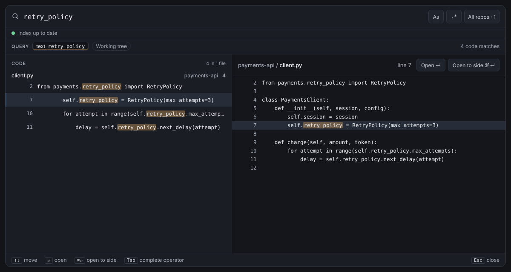

# Unified Search

**One search box for file names, code and Git history, across every repo in your VS Code workspace.**

```text
author:jane f:.*test\.py$ (timeout OR retry) -f:vendor/ since:6m
```

That query finds Jane's commits from the last six months that changed a Python test outside `vendor/` and added or
removed `timeout` or `retry`. Drop `author:` and the same box searches current files instead.



> **Status: early development.** The skeleton works end to end and the query language is parsed in full. The indexes
> are being built now; see [progress](docs/dev/progress.md). There is no Marketplace release yet.

## Features (v1 scope)

- **One query language.** Combine text, `"phrases"`, `/regex/`, `AND`, `OR`, `( )` and `-exclusions` with
  operators: `f:` (path), `repo:`, `lang:`, `type:`, `sym:`, `author:`, `msg:`, `since:`, `case:`, `count:`.
- **Results as you type,** from local indexes: a trigram index of current files, symbols, and a commit index of
  diffs, messages and authors.
- **Helpful when you're wrong:** errors with one-key fixes, completions for operators and values (authors, repos,
  languages), and notes like "3 commits hidden by `-f:vendor/`".
- **Keyboard first:** ⌘P or ⇧⌘F (the `unifiedSearch.shortcut.preset` setting), ↵ to open at the match, ⌘↵ to
  open to the side, F4 to step through results.
- Works the same in desktop VS Code and code-server.

## Repository layout

| Path | What lives there |
| --- | --- |
| [`daemon/`](daemon/) | Go search daemon: parser, planner, indexes, engines |
| [`extension/`](extension/) | VS Code extension host (TypeScript) |
| [`webview/`](webview/) | The search panel (TypeScript, no framework) |
| [`protocol/`](protocol/) | JSON Schema for every cross-process message, plus the type generator |
| [`docs/`](docs/) | User docs, decision records, and planning docs |
| [`scripts/`](scripts/) | `test-all.sh`, the spec-coverage check and the panel screenshot tool |
| [`testdata/`](testdata/) | A fixture workspace whose files match the mocks |

[ARCHITECTURE.md](ARCHITECTURE.md) explains how the pieces fit together.

## Development

```sh
npm install && npx playwright install chromium
npm test        # every test layer, including the Go daemon
```

Then open `extension/` in VS Code and press F5. See [CONTRIBUTING.md](CONTRIBUTING.md) for conventions, and
[docs/](docs/README.md) for everything else.

## License

[MIT](LICENSE)
