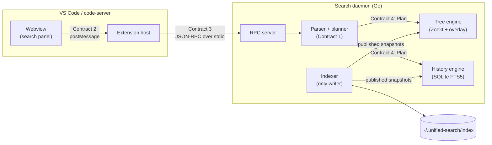

# Unified Search — Implementation Plan

Oct 3, 2026 · @Gourav Mittal

> **Partly superseded.** [ADR 0003](../adr/0003-in-house-trigram-index.md) replaced Zoekt with an in-house trigram
> index, and [ADR 0004](../adr/0004-in-house-history-index.md) replaced SQLite FTS5 with an in-house history index.
> Where this plan names Zoekt, ctags or SQLite, the ADRs describe what was built.

## Scope

v1 is a VS Code extension plus a local search daemon that answers one query language over current files and Git history,
across every repo in the workspace, as you type. It runs the same way in desktop VS Code and in code-server.

### In v1

- One search box (mocks 1–14): blended file-name and code results, a parsed-query chip row, a preview pane,
  autocomplete, the operator sheet, error fix-its and empty states.
- Operators: `case:` `"…"` `/…/` `AND` `OR` `( )` `-` `f:` `repo:` `lang:` `type:` `sym:` `author:` `msg:` `since:`
  `count:`.
- Two indexes per repo: a working-tree index (trigram + symbols) and a history index (commit diffs, messages, authors,
  dates).
- Opening results: click previews, double-click or Enter opens at the line, ⌘Enter opens to the side, F4 steps through
  results.
- Setup and support (mocks 15–18): first-run shortcut picker, indexing progress, help page, settings.

### Not in v1

- The AI chat panel and highlight-to-context.
- `branch:`, following renames through history, saved searches, replace-in-files.
- A shared index across machines or users.

**Sizing assumption:** up to 5 repos, about 2 million lines of code and 100,000 commits inside the indexed history
window. Performance budgets in this plan are set against that size.

## Architecture

Three processes split the work. The webview draws, the extension host plugs into VS Code, and the search daemon owns
every file, Git and index operation.



A keystroke travels webview → extension → RPC server → planner → one engine, and results stream back the same way in
batches. The indexer is the only writer to the index directory.

### Who owns what

| Component | Owns | Must never |
| --- | --- | --- |
| Webview | Rendering, debouncing, applying fix-its and completions as text edits | Read files, call Git, reach the daemon, or parse queries |
| Extension host | Commands, keybindings, settings, context keys, spawning the daemon, opening editors | Search, parse, or keep results beyond the current list |
| RPC server | Request lifecycle, cancellation, search IDs, batching | Read or write an index |
| Parser and planner | Grammar, diagnostics, completions, choosing the mode | Do I/O beyond author and repo lookups |
| Tree engine | Working-tree results and file previews | Write to an index |
| History engine | Commit results and commit previews | Write to an index |
| Indexer | Building, updating and publishing both indexes; the per-repo lock | Answer searches |

### Code layout

```text
unified-search/
  protocol/    protocol.schema.json (Contracts 1-3) and gen.mjs, which writes the TypeScript and Go types
  extension/   TypeScript: the VS Code extension host (src/, tests in src/test/)
  webview/     TypeScript: the search panel (src/, render/ modules; Playwright tests in test/)
  daemon/      Go module github.com/cruisinme30/unified-search/daemon
    cmd/unified-search-daemon/   the binary
    internal/  rpc/, protocol/ (generated), server/, query/ (parser, planner), lang/,
               trigram/ (working-tree engine), history/, indexer/
  testdata/    fixture repos (built by script) and golden files
  docs/        user docs, ADRs, and these planning docs under docs/dev/
```

`protocol/` is the single source of truth for shared types. Neither side hand-writes a type that crosses a boundary.

## Contract 1: query language and parsed query

The daemon owns the only parser. The webview, the extension host and both engines consume its output and never re-parse
the raw string.

### Grammar

```ebnf
query    = [ orExpr ] ;
orExpr   = andExpr { "OR" andExpr } ;
andExpr  = unary { [ "AND" ] unary } ;       (* a space is an implicit AND *)
unary    = [ "-" ] primary ;
primary  = "(" orExpr ")" | operator | term ;
operator = name ":" value ;
name     = "f" | "file" | "r" | "repo" | "l" | "language" | "lang"
         | "t" | "type" | "s" | "symbol" | "sym" | "a" | "author"
         | "m" | "message" | "msg" | "d" | "since" | "c" | "case"
         | "n" | "count" ;
value    = quoted | regex | bare ;
term     = quoted | regex | bare ;
quoted   = '"' { char | '\\"' } '"' ;
regex    = "/" { char | "\\/" } "/" ;
bare     = 1*( any char except space, "(", ")", '"' ) ;
```

### Lexical rules

- Every operator has a full name and a one-letter short name: `file:` `f:`, `repo:` `r:`, `language:` `l:`,
  `type:` `t:`, `symbol:` `s:`, `author:` `a:`, `message:` `m:`, `since:` `d:`, `case:` `c:`, `count:` `n:`. The
  older `lang:`, `sym:` and `msg:` still work. Suggestions and help show the full name.
- `AND` and `OR` are keywords only in uppercase. Lowercase `or` is a search term.
- AND binds tighter than OR. `a b OR c` means `(a b) OR c`.
- A word shaped like `name:` with an unknown name is an error, not a term. Quoting it (`"sinse:6m"`) makes it a term.
- Regexes are RE2 syntax. RE2 runs in linear time, so no query can hang the daemon.

### Operator semantics

| Operator | Value | Matches against | Modes |
| --- | --- | --- | --- |
| `f:` | Regex, even without slashes | Full path relative to the repo root | Both |
| `repo:` | Regex | Repo display name | Both |
| `lang:` | Name or alias (`python`, `py`) | Language detected from extension and shebang | Both |
| `sym:` | Literal or `/regex/` | Symbol definition names | Working tree only |
| `author:` | Substring, or quoted full name | Author name and email, after `.mailmap` | History only |
| `msg:` | Literal, phrase or regex | Commit subject and body | History only |
| `since:` | `<n>d`, `<n>w`, `<n>m` or `<n>y` | Commit date in history; last change time on current files | Both |
| `type:` | `file`, `code` or `commit` | Which result kinds are returned | Both |
| `case:` | `yes` or `no` | Case handling for every text match in the query | Both |
| `count:` | Positive integer or `all` | Result limit | Both |

### Rules the parser enforces

1. `case:`, `count:` and `type:` are global. They may appear once, at the top level, never inside `( )`, after `-` or
   inside an OR branch.
2. The query has one mode. `author:`, `msg:` or `type:commit` anywhere makes it a history query. Otherwise it is a
   working-tree query.
3. An OR whose branches would need different modes is an error, because one result list cannot mix commits and lines.
4. `sym:` in a history query is an error. `since:` works in both modes with the meaning shown above.
5. A query with no positive terms, such as `-timeout` alone, is an error.

### Parsed query (the AST)

```ts
type ParsedQuery = {
  version: 1;
  raw: string;
  root: Node | null;                 // null when the box is empty
  globals: { case: "yes" | "no" | null; count: number | "all" | null;
             type: "file" | "code" | "commit" | null };
  mode: "workingTree" | "history";
  diagnostics: Diagnostic[];         // empty means the query can run
};

type Node =
  | { kind: "and" | "or"; children: Node[]; span: Span }
  | { kind: "not"; child: Node; span: Span }
  | { kind: "text"; value: string; match: Match; termIndex: number; span: Span }
  | { kind: "op"; op: OpName; value: string; match: Match; span: Span;
      resolved?: { label: string } };  // e.g. "jane" -> "Jane Doe", "web" -> "web-checkout"

type Match = "literal" | "phrase" | "regex";
type Span = { start: number; end: number };   // UTF-16 offsets into raw
type Diagnostic = { severity: "error" | "warning"; code: string;
                    message: string; span: Span; fixes: Fix[] };
type Fix = { title: string; edits: { span: Span; newText: string }[] };
```

`termIndex` numbers each text term, so the UI can give OR branches their own highlight colors (mock 7). `resolved`
drives labels such as "→ Jane Doe" in the chip row.

### Diagnostic codes

| Code | Example | Fix offered |
| --- | --- | --- |
| `unclosed_paren` | `(timeout OR retry` | Insert `)` after the last term in the group |
| `unknown_operator` | `sinse:6m` | Nearest operator by edit distance |
| `bad_value` | `since:6x`, `count:-1` | Valid examples |
| `global_misplaced` | `(case:yes a) OR b` | Move it to the top level |
| `mixed_mode_or` | `author:jane OR f:x` | None; explain the rule |
| `op_wrong_mode` | `author:jane sym:Foo` | Remove the operator |
| `invalid_regex` | `/Retry(/` | None; show the RE2 error |
| `no_positive_term` | `-timeout` | None |

## Contract 2: webview ↔ extension host

The webview is a pure view. It renders what the host sends and reports what the user did; it never touches files, Git or
the daemon.

**Envelope.** Every message is `{ v: 1, type: string, seq?: number, payload: object }` sent with `postMessage`. `seq`
increases with each keystroke. Any response carrying an older `seq` than the newest one sent is dropped by the webview.

### Webview → host

| Type | Payload | Host does |
| --- | --- | --- |
| `query.changed` | `{ text, cursor, seq }` | Calls `query/parse`. If the query has no errors, cancels the running search and starts `search/start` |
| `result.select` | `{ ref }` | Calls `preview/get` and returns the preview |
| `result.open` | `{ ref, where: "current" \| "side" }` | Opens the file at the line, or the commit diff, and hides the panel if `closeOnOpen` is on |
| `results.more` | `{ searchId, cursor }` | Calls `search/start` with the cursor to load the next page |
| `panel.close` | `{}` | Hides the panel and keeps the last query and results |
| `help.open` / `settings.open` | `{}` | Opens the help tab, or Settings filtered to `@ext:unified-search` |

Debouncing lives in the webview, using `typingDelayMs`. Applying a fix-it, accepting a completion and toggling Aa or
`.*` are text edits done in the webview, followed by a normal `query.changed`.

### Host → webview

| Type | Payload | Drives |
| --- | --- | --- |
| `parse.result` | `{ seq, query: ParsedQuery, completions: Completion[] }` | Chip row, error panel, autocomplete, Aa and `.*` toggle state |
| `search.batch` | `{ seq, searchId, items: ResultItem[] }` | Appends results as they stream in |
| `search.done` | `{ seq, searchId, total, truncated, nextCursor?, hidden: HiddenNote[], ms }` | Counts, "Load more", and the "N hidden by …" notes |
| `preview.result` | `{ ref, preview: Preview }` | Right-hand pane |
| `index.status` | `{ repos: RepoStatus[] }` | Header dot, indexing banner (mock 14) |
| `state.restore` | `{ text, recent: string[] }` | Reopening the panel where you left it |

The shared types `ResultItem`, `Preview`, `HiddenNote`, `Completion` and `RepoStatus` are defined once in Contract 3 and
used unchanged here.

## Contract 3: extension host ↔ search daemon

The host talks to the daemon over JSON-RPC 2.0 on the daemon's stdin and stdout, with LSP-style `Content-Length`
framing. There is no network port. The host spawns one daemon per VS Code window and restarts it if it dies.

### Lifecycle

1. Host spawns the daemon binary bundled for the platform and sends `initialize`.
2. The daemon replies with its version and the protocol version. On a protocol mismatch the host shows an error and
   stops.
3. Host sends `workspace/setRoots` whenever folders are added or removed, and `settings/update` whenever a
   `unifiedSearch.*` setting changes.
4. On exit the host sends `shutdown`, then `exit`. The daemon must flush index writes within 2 seconds.

### Methods

| Method | Kind | Params | Result |
| --- | --- | --- | --- |
| `initialize` | request | `{ protocol: 1, roots: Root[], settings: Settings }` | `{ daemonVersion, protocol: 1 }` |
| `workspace/setRoots` | notification | `{ roots: Root[] }` | — |
| `settings/update` | notification | `{ settings: Settings }` | — |
| `query/parse` | request | `{ text, cursor }` | `{ query: ParsedQuery, completions: Completion[] }` |
| `search/start` | request | `{ searchId, text, cursor? }` | `{ total, truncated, nextCursor?, hidden: HiddenNote[], ms }` |
| `search/batch` | notification, daemon → host | `{ searchId, items: ResultItem[] }` | — |
| `$/cancelRequest` | notification | `{ id }` | — |
| `preview/get` | request | `{ ref, contextLines }` | `Preview` |
| `open/resolve` | request | `{ ref }` | `{ path, line, column, length }` or `{ repoId, sha, path }` |
| `index/status` | request | `{}` | `{ repos: RepoStatus[] }` |
| `index/progress` | notification, daemon → host | `{ repos: RepoStatus[] }` | — |
| `index/rebuild` | request | `{ repoId? }` | `{}` |
| `shutdown` / `exit` | request / notification | `{}` | `{}` / — |

`search/start` re-parses `text` itself rather than accepting an AST, so the daemon never trusts a parse it did not make.
Results stream as `search/batch` notifications of up to 200 items; the request's response marks the end.

### Shared types

```ts
type Root = { id: string; path: string; name: string };   // id = first 12 hex of sha256(path)

type ResultItem =
  | { kind: "file"; ref: string; repoId: string; path: string; nameHits: Range[];
      lastCommit?: { sha: string; author: string; at: string }; dirty: boolean }
  | { kind: "line"; ref: string; repoId: string; path: string; line: number;
      text: string; hits: Hit[] }
  | { kind: "symbol"; ref: string; repoId: string; path: string; line: number;
      name: string; symbolKind: "class" | "interface" | "function" | "method" | "type" | "other";
      hits: Range[] }
  | { kind: "commit"; ref: string; repoId: string; sha: string; subject: string;
      author: { name: string; email: string }; at: string;
      files: { path: string; added: number; removed: number }[];
      diffHits: number; matchedTerms: number[]; subjectHits: Range[] };

type Range = { start: number; end: number };              // UTF-16 offsets in the shown text
type Hit = Range & { termIndex: number };                 // which text term matched, for colors

type Preview =
  | { kind: "file"; path: string; firstLine: number; lines: string[];
      focusLine: number; hits: { line: number; ranges: Hit[] }[];
      dirtyLines: number[]; symbols?: { name: string; line: number }[] }
  | { kind: "commit"; sha: string; subject: string; body: string; author: string; at: string;
      files: { path: string; added: number; removed: number; hiddenByFilter: boolean }[];
      hunks: { path: string; header: string;
               lines: { kind: "ctx" | "add" | "del"; oldNo?: number; newNo?: number;
                        text: string; hits: Hit[] }[] }[] };

type HiddenNote = { reason: "not" | "since" | "case" | "type" | "pathFilter";
                    count: number; unit: "matches" | "files" | "commits"; undo: Fix };

type Completion = { label: string; detail: string; insert: Fix;
                    group: "operator" | "author" | "repo" | "lang" | "value" };

type RepoStatus = { repoId: string; name: string;
                    tree: "ready" | "indexing" | "queued" | "error";
                    history: "ready" | "indexing" | "queued" | "error" | "off";
                    progress?: number; message?: string };
```

`ref` is opaque to the host and webview. Only the daemon creates or reads it, so the result format can change without
touching the UI.

**Error codes** (JSON-RPC `error.code`)

| Code | Name | When |
| --- | --- | --- |
| -32800 | `RequestCancelled` | A newer keystroke cancelled this search |
| 1001 | `QueryInvalid` | `search/start` got a query with error diagnostics |
| 1002 | `IndexNotReady` | A repo has no index yet; partial results still stream |
| 1003 | `RefStale` | The file or commit behind a `ref` is gone |
| 1004 | `IndexCorrupt` | A shard or database failed a check; a rebuild starts on its own |
| 1005 | `Overloaded` | The search exceeded its time budget and returned what it had |

## Contract 4: engines inside the daemon

Inside the daemon, a planner turns the parsed query into a plan, and exactly one engine runs it. Engines never see raw
query text, and the RPC layer never touches an index.

```go
// Planner: ParsedQuery + settings -> Plan. Pure function, no I/O except identity lookups.
type Planner interface {
    Plan(q *ast.ParsedQuery, s Settings) (Plan, []ast.Diagnostic)
}

type Plan struct {
    Mode      Mode            // WorkingTree or History
    Kinds     KindSet         // file, line, symbol, commit
    Pred      Pred            // lowered boolean tree, below
    Repos     []RepoID        // after repo: filtering
    Since     *time.Time      // nil when absent
    CaseSens  bool
    Limit     int             // count:, or settings default; 0 = all (hard cap 50,000)
    Cursor    *Cursor
}

// Pred leaves are typed; engines switch on them.
type Pred interface{ isPred() }
type And struct{ Kids []Pred }
type Or  struct{ Kids []Pred }
type Not struct{ Kid Pred }
type Content struct{ Re *regexp.Regexp; Literal string; TermIndex int } // literal kept for trigram prefilter
type Path struct{ Re *regexp.Regexp }
type Lang struct{ Names []string }
type Symbol struct{ Re *regexp.Regexp }
type Author struct{ Identities []Identity }      // resolved through .mailmap
type Message struct{ Re *regexp.Regexp }

// Every engine streams into a sink and stops when ctx is cancelled.
type Engine interface {
    Search(ctx context.Context, p Plan, sink Sink) (Stats, error)
}
type Sink interface {
    Emit(items []ResultItem) error   // batches of up to 200
    Hidden(note HiddenNote)
}

type TreeEngine interface {
    Engine                                        // Zoekt shards + dirty-file overlay
    Preview(ref Ref, contextLines int) (Preview, error)
    Langs(repo RepoID) []string                  // for lang: completions
}

type HistoryEngine interface {
    Engine                                        // SQLite commit store
    Preview(ref Ref) (Preview, error)
    Authors(prefix string, limit int) ([]AuthorStat, error)   // for author: completions
}

type Indexer interface {
    Ensure(r Repo)                // start or resume indexing a root
    Drop(id RepoID)               // root removed
    Status() []RepoStatus
    Subscribe() <-chan []RepoStatus
}
```

### Boundary rules

- The planner decides the mode. Engines reject a plan of the wrong mode with an error instead of guessing.
- `HiddenNote` counts come from the engine that applied the filter. The planner adds the `undo` fix by deleting that
  filter's span from the query.
- `ResultItem` values are built only inside engines. The RPC layer forwards them without changing them.
- `TreeEngine` and `HistoryEngine` read only through the `Indexer`'s published snapshots, so a search never sees a
  half-written index.
- Either engine can be swapped out behind its interface. For example, the history engine could be rewritten in C++ as a
  separate process speaking the same plan and result shapes.

## Indexing

Each repo gets two indexes on disk: Zoekt shards for current files and a SQLite database for history. Both are built
once at import and then updated incrementally, so searches never scan raw files.

### First build, per repo

1. **Walk the working tree.** Respect `.gitignore` unless `includeIgnored` is on, then apply `index.exclude`, skip files
   over `maxFileSizeKB`, and skip binaries (a NUL byte in the first 8 KB).
2. **Build the tree shard.** Feed the files to Zoekt's index builder, with universal-ctags extracting symbols when
   `index.symbols` is on. Run ctags as a separate process.
3. **Record last-change times.** One pass over `git log --name-only` fills a `file_touch` table with each path's most
   recent commit time and SHA. This powers `since:` on current files.
4. **Ingest history, newest first.** Stream `git log -p --first-parent` limited to `historyDepth`, writing in batches of
   500 commits. Newest-first means recent history becomes searchable within seconds.
5. **Publish.** Swap the new shard and database snapshot in atomically, then report `ready`.

### History store schema

```sql
CREATE TABLE commits (
  id INTEGER PRIMARY KEY, sha TEXT UNIQUE, author_name TEXT, author_email TEXT,
  authored_at INTEGER, subject TEXT, body TEXT);
CREATE TABLE changes (
  id INTEGER PRIMARY KEY, commit_id INTEGER REFERENCES commits(id),
  path TEXT, added INTEGER, removed INTEGER, diff_text TEXT);   -- +/- lines only, no context
CREATE VIRTUAL TABLE changes_fts USING fts5(diff_text, content='changes', tokenize='trigram');
CREATE VIRTUAL TABLE commits_fts USING fts5(subject, body, content='commits', tokenize='trigram');
CREATE TABLE file_touch (path TEXT PRIMARY KEY, last_at INTEGER, last_sha TEXT);
CREATE INDEX commits_by_time ON commits(authored_at);
CREATE INDEX commits_by_author ON commits(author_email);
```

The trigram tokenizer narrows candidates; Go's RE2 then verifies each candidate line. Diffs for a single file over 1 MB,
and merge commits other than their first-parent diff, are not stored.

### Keeping it fresh

| Event | Detected by | Update | Visible within |
| --- | --- | --- | --- |
| A file is saved | fsnotify on the working tree | Re-read the file into an in-memory overlay; mask its old entries in the shard | 1 second |
| A file is created or deleted | fsnotify | Add to the overlay, or add a tombstone | 1 second |
| New commits (commit, pull, merge) | Watch `.git/HEAD` and `.git/refs` | Ingest `lastIndexedSha..HEAD` into history; refresh `file_touch` for touched paths | 5 seconds |
| History rewritten (rebase, reset) | `lastIndexedSha` is no longer reachable | Re-ingest the `historyDepth` window | Minutes, in the background |
| Overlay reaches 500 files, or 10 minutes idle | Indexer timer | Rebuild the tree shard and clear the overlay | Background |
| Branch switch | `.git/HEAD` changes | Treated as many saves; a full shard rebuild if more than 500 files changed | Seconds to minutes |

Uncommitted edits count as changed now for `since:` by marking those paths dirty in the overlay.

### Storage layout

```text
~/.unified-search/index/
  manifest.json              schema version, known repos
  <repoId>/
    lock                     held by the daemon that writes this repo
    state.json               lastIndexedSha, last full build, status
    tree/*.zoekt             working-tree shards
    history.sqlite           commits, changes, FTS tables, file_touch
```

Two VS Code windows on the same repo share one index. The first daemon to take `lock` writes; the others open the index
read-only and reload when `state.json` changes. A `manifest.json` schema version mismatch triggers a rebuild rather than
a migration.

## Contract 5: settings, commands and keybindings

Everything users configure is declared in `package.json`, so VS Code provides the Settings UI, `settings.json`, settings
sync and per-workspace overrides. The extension builds no settings screen of its own.

**Settings** (`contributes.configuration`)

| Key | Type | Default | Scope |
| --- | --- | --- | --- |
| `unifiedSearch.shortcut.preset` | `"quickOpen"` \| `"findInFiles"` \| `"none"` | `"quickOpen"` | application |
| `unifiedSearch.caseSensitive` | boolean | `false` | resource |
| `unifiedSearch.defaultCount` | integer, 1–50000 | `500` | resource |
| `unifiedSearch.typingDelayMs` | integer, 0–1000 | `120` | application |
| `unifiedSearch.open.trigger` | `"doubleClick"` \| `"singleClick"` | `"doubleClick"` | application |
| `unifiedSearch.open.preview` | boolean | `true` | application |
| `unifiedSearch.open.closeOnOpen` | boolean | `true` | application |
| `unifiedSearch.index.historyDepth` | `"6m"` \| `"2y"` \| `"all"` | `"2y"` | resource |
| `unifiedSearch.index.symbols` | boolean | `true` | resource |
| `unifiedSearch.index.exclude` | string\[\] of globs | `["**/vendor/**", "**/node_modules/**", "**/*.min.js"]` | resource |
| `unifiedSearch.index.includeIgnored` | boolean | `false` | resource |
| `unifiedSearch.index.maxFileSizeKB` | integer | `1024` | resource |
| `unifiedSearch.index.location` | string, path | `~/.unified-search/index` | machine |
| `unifiedSearch.ui.showParsedQuery` | boolean | `true` | application |
| `unifiedSearch.ui.recentQueries` | integer, 0–100 | `20` | application |

`resource` settings can differ per repo through `.vscode/settings.json`. `machine` settings never sync, because index
paths differ between computers.

**Commands** (`contributes.commands`)

| Command | Title | Notes |
| --- | --- | --- |
| `unifiedSearch.open` | Unified Search: Open | Optional argument `{ query: string }` pre-fills the box |
| `unifiedSearch.openHelp` | Unified Search: Open Help | Mock 17 |
| `unifiedSearch.showWelcome` | Unified Search: Show Welcome | Mock 15; runs on first activation |
| `unifiedSearch.nextResult` / `prevResult` | Next / Previous Result | Steps through the last result list without reopening the panel |
| `unifiedSearch.rebuildIndex` | Unified Search: Rebuild Index | Asks which repo, or all |

**Keybindings** (`contributes.keybindings`)

An extension cannot ask questions while it installs, so the shortcut choice happens on the first-run page. Each preset
is a set of bindings gated on the preset setting; choosing an option only writes that setting.

```json
[
  { "command": "unifiedSearch.open", "key": "ctrl+p", "mac": "cmd+p",
    "when": "config.unifiedSearch.shortcut.preset == 'quickOpen'" },
  { "command": "workbench.action.quickOpen", "key": "ctrl+alt+p", "mac": "cmd+alt+p",
    "when": "config.unifiedSearch.shortcut.preset == 'quickOpen'" },
  { "command": "unifiedSearch.open", "key": "ctrl+shift+f", "mac": "cmd+shift+f",
    "when": "config.unifiedSearch.shortcut.preset == 'findInFiles'" },
  { "command": "unifiedSearch.nextResult", "key": "f4",
    "when": "unifiedSearch.hasResults && !searchViewletFocus" },
  { "command": "unifiedSearch.prevResult", "key": "shift+f4",
    "when": "unifiedSearch.hasResults && !searchViewletFocus" }
]
```

"Choose my own" sets the preset to `none` and opens Keyboard Shortcuts filtered to `unifiedSearch.open`. Bindings the
user sets there always override the extension's.

**Context keys the extension sets:** `unifiedSearch.panelOpen` and `unifiedSearch.hasResults`, through `setContext`.

## Errors, limits and performance budgets

Every budget below is a p95 on the sizing assumption in Scope, measured from the keystroke in the webview to the first
pixel of the result. A milestone is not done until its budgets pass in CI.

### Budgets

| Path | Budget (p95) |
| --- | --- |
| Keystroke → chips and diagnostics (`query/parse`) | 15 ms |
| Keystroke → first working-tree results | 100 ms after the typing delay |
| Keystroke → first history results | 250 ms after the typing delay |
| Select → preview | 50 ms |
| File saved → findable | 1 s |
| New commit → findable by `author:` | 5 s |
| First build, working tree | 2 minutes |
| First build, history window | 15 minutes, with recent commits searchable in the first minute |
| Daemon memory, steady state | 1 GB |

### Hard limits

- Query length: 1,000 characters.
- Results: `count:all` stops at 50,000 and reports `truncated`.
- Search time: 2 seconds, after which it returns what it has with `Overloaded`.
- Regex: RE2 only. No backreferences or lookaround; the parser explains this in `invalid_regex`.

### Failure handling

| Failure | Who handles it | What the user sees |
| --- | --- | --- |
| Daemon crashes | Host restarts it, up to 3 times per minute | A banner: "Search restarting…", then "Search stopped — Restart" if it keeps failing |
| Index corrupt | Daemon rebuilds that repo | That repo's status turns to indexing; other repos keep working |
| Repo still indexing | Daemon streams partial results | The indexing banner from mock 14 |
| Git not installed, or not a repo | Daemon indexes the tree only | History operators return a `history_unavailable` error that says why |
| `ref` is stale (file deleted, history rewritten) | Daemon returns `RefStale` | The result greys out with "No longer exists" |
| Disk full while indexing | Daemon stops writing, keeps the last good snapshot | A one-line warning in the indexing banner |

## Testing

Each contract gets its own tests, so a change on one side of a boundary fails fast without running the whole stack.

| Boundary | Test | Oracle or fixture |
| --- | --- | --- |
| Contract 1, parser | Golden files: query in, AST and diagnostics JSON out. Go native fuzzing must never panic or hang | Hand-written goldens, one per grammar rule and diagnostic code |
| Planner | Golden files: AST in, plan out, including mode choice and every rejection rule | Same goldens, extended |
| Tree engine | Fixture repos built by a script; results compared to an independent search | ripgrep on the same files with the same flags |
| History engine | Fixture repos with fixed authors and dates (`GIT_AUTHOR_DATE`, `GIT_AUTHOR_NAME`) | `git log -G <re> --author <a> -- <path>` on the same repo |
| Freshness | Edit, create, delete, commit, rebase in a fixture, then search within the budget | Expected result lists per step |
| Contract 3, RPC | Each shared type has one JSON Schema; both the Go and TypeScript sides validate recorded transcripts against it | Transcripts captured from M1 onward |
| Contract 2, webview | Component tests drive the UI with recorded host messages; screenshot tests compare against mocks 1–16 | The Design canvas |
| Contract 5, extension | `@vscode/test-electron`: each shortcut preset, double-click opens at the right line, F4 steps, settings round-trip | A fixture workspace |
| Budgets | Benchmark suite on one large open-source repo, run nightly, fails above budget | The Budgets table |

The differential tests against ripgrep and `git log -G` are the main safety net: any disagreement is a bug in one of the
two engines.

The full test plan, with an end-to-end scenario for every mock and every failure mode, is in Test plan.

## Milestones

The build runs in six milestones, about 13 weeks for one developer. Each ends at a gate: named mocks working end to end,
with their budgets passing in CI.

| Milestone | Length | Scope | Exit gate |
| --- | --- | --- | --- |
| M0 · Skeleton | 1 week | Daemon spawned over stdio; JSON-RPC handshake. Webview shell; `protocol/` types generated. Opening a file at a line works | One hard-coded search round-trips |
| M1 · Query language + tree search | 3 weeks | Parser, diagnostics and fix-its for every rule. Zoekt index for one repo: text, `f:`, `case:`, regex. Results, preview, double-click to open | Mocks 1, 2, 8, 13; parse under 15 ms |
| M2 · Workspace scope + discovery (parallel with M3) | 2 weeks | Many repos; `repo:`, `lang:`, `type:`, `count:`. Operator autocomplete, cheat sheet, help page. Hidden-result notes with undo | Mocks 4, 5, 12, 17 |
| M3 · History (parallel with M2) | 3 weeks | Commit ingest, newest first, into SQLite FTS5. `author:`, `msg:`, `since:` on commits; OR colors. Author autocomplete with `.mailmap` | Mocks 3, 6, 7, 11; history under 250 ms |
| M4 · Freshness + symbols | 2 weeks | Dirty-file overlay, tombstones, compaction. `file_touch`, and `since:` on current files. `sym:` through universal-ctags | Mocks 9, 10, 14; saves findable in 1 s |
| M5 · Setup + release | 2 weeks | First-run page and shortcut presets. Settings, error banners, daemon restarts. Per-platform `.vsix` on Marketplace and Open VSX | Mocks 15, 16, 18; every budget green |

Estimates: about 13 weeks for one developer, about 11 for two.

M2 and M3 share only the M1 contracts, so a second developer can take M2 while M3 runs. Contracts 1 to 3 freeze at the
end of M1; any later change bumps the protocol version and updates the JSON Schemas first.

## Risks and open decisions

### Risks

| Risk | Effect | Mitigation |
| --- | --- | --- |
| History index too large on big repos | Gigabytes of diff text, slow first build | Default `historyDepth` of 2 years; skip per-file diffs over 1 MB; honor `index.exclude` in history too |
| Zoekt shards are immutable | Rebuilding a large repo on every save would be too slow | The in-memory overlay with tombstones; rebuild only at 500 dirty files or when idle |
| FTS5 trigram cannot answer every regex | Some regexes have no usable trigram, so they scan every row | Planner requires at least one 3-character literal per history regex, or a narrowing filter (`author:`, `since:`, `f:`); otherwise it returns a warning and a scan capped at 2 seconds |
| Shortcut collisions | `⌥⌘P` or `F4` may already be bound for some users | The first-run page checks existing bindings for those keys and warns before saving |
| code-server's extension source | code-server installs from Open VSX, not the Microsoft Marketplace | Publish to both, and ship a `.vsix` per platform with the daemon bundled |
| Licensing | Zoekt is Apache-2.0; universal-ctags is GPL-2.0 | Run ctags as a separate process, never linked into the daemon |

### Open decisions

- **Daemon language.** Go is the default because Zoekt is a Go library and embeds directly. The history engine is the
  one piece that could be written in C++ instead, behind the `HistoryEngine` contract, at the cost of a second process
  and a second build toolchain.
- **Renames in history.** v1 matches `f:` against each commit's path as it was then. Following renames (`git log
  --follow`) works per file only, so it is left for later.
- **Merge commits.** v1 indexes only first-parent diffs, so a change appears once, at the commit that introduced it on
  the main line. Indexing every parent would triple the size of busy repos.
- **Mixed-mode OR.** v1 rejects queries like `author:jane OR f:x`. A later version could show commits and lines as two
  sections instead.
