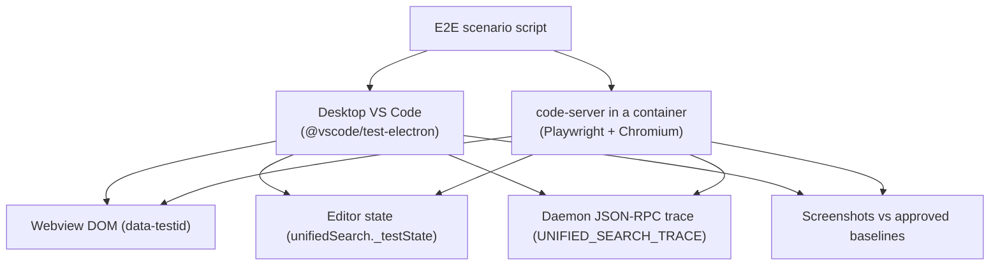

# Test plan

Every user-visible behavior is proven by an automated scenario that runs the real extension, the real daemon and real Git repos, in desktop VS Code and in code-server, before a change merges.

## Test layers

Six layers, each proving something the layer below cannot. Only L4 and above exercise the whole system, but a failure should almost always show up first in a cheaper layer.

| Layer | Proves | Runs for real | Faked | When | Time limit |
| --- | --- | --- | --- | --- | --- |
| L1 Unit | Parser, planner, diagnostics, fix-its, ranking, small helpers | The function under test | Everything else | Every commit | 1 min |
| L2 Contract | Each side of each contract on its own: engines against oracles, RPC messages against the JSON Schemas, the webview against recorded host messages | One component plus fixture repos | The other side of the contract, from recorded transcripts | Every commit | 3 min |
| L3 Daemon integration | The whole daemon through its stdio API: indexing, freshness, cancellation, crash recovery | Daemon binary, Git, ctags, fixture repos | VS Code; a test client speaks JSON-RPC | Every pull request | 10 min |
| L4 End to end | Every mock's behavior, keyboard and mouse included | Everything: VS Code or code-server, extension, webview, daemon, Git | Only the clock, frozen for date-relative results | Smoke set on every pull request; full set on merge | 15 min smoke; 45 min full |
| L5 Performance and soak | Budgets, memory, long-run stability, index consistency | Everything, on a large real repo | Nothing | Nightly | 10 hours |
| L6 Release | Install and first run on clean machines, every platform | The published `.vsix` files | Nothing | Each release candidate | 1 day, partly manual |

## End-to-end harness

Each E2E scenario is one script that runs unchanged against two targets: desktop VS Code and code-server in a browser. The runner drives the UI like a person and reads every layer underneath to check the result.

The runner observes four places: the webview DOM, the editor through `_testState`, the daemon's JSON-RPC trace, and screenshots. So a failure points straight at the layer that broke. Desktop runs use `@vscode/test-electron` to launch VS Code; code-server runs in a container that Playwright opens in Chromium.

## Fixture workspace

A script builds the same three repos the mocks show, byte for byte, every time. Because the results are known in advance, every E2E assertion can name exact files, lines and commits.

The script `testdata/build-fixtures` creates `payments-api`, `web-checkout` and `shared-libs`. It sets `GIT_AUTHOR_DATE` and `GIT_COMMITTER_DATE` relative to a fixed "now", which tests also pass to the daemon through `UNIFIED_SEARCH_NOW`. So "3 days ago" means the same thing in every run.

| Fixture feature | Exercises |
| --- | --- |
| The files and code shown in mocks 1–14 (`client.py`, `retry_policy.py`, the tests) | Exact expected results for every mock scenario |
| Authors Jane Doe, Jason Kim and Marta Ruiz, with a `.mailmap` joining two of Jane's emails | `author:` matching, value autocomplete, identity merging |
| Commits spread from 2 days to 3 years before "now" | `since:` windows, `historyDepth` cutoffs |
| A merge commit, a rename, and a force-pushed branch | First-parent indexing, path-at-the-time matching, the rewrite-recovery path |
| A `vendor/` folder and `.gitignore`'d build output | `-f:vendor/`, `index.exclude`, `includeIgnored` |
| A 2 MB file, a binary file, and a file with one 50,000-character line | Size limit, binary skip, preview truncation |
| Non-ASCII content: accented names, emoji and CJK in strings | UTF-16 offsets in every `Range` and `Hit` |
| Python, TypeScript and Go files with classes, interfaces and methods | `lang:`, `sym:` kinds, the outline in the preview |
| One folder that is not a Git repo | `history_unavailable` |
| An uncommitted edit applied by the test at run time | "Uncommitted changes" and `since:` on current files |

The large repo for performance is a real open-source project pinned to one commit, so its numbers are comparable night to night.

## Scenario catalog

Each mock becomes one E2E scenario with exact expected results, plus twelve scenarios for what the mocks cannot show: freshness, concurrency, failures and the remote setup. All run on desktop VS Code and on code-server.

Assertions read four things: the webview DOM through stable `data-testid` attributes, the editor's state through a test-only command, the daemon's JSON-RPC transcript, and a screenshot compared to an approved baseline.

**One scenario per mock**

| ID | Mock | Steps | Must hold |
| --- | --- | --- | --- |
| E01 | 1 | Type `retry_policy` | 3 file-name results and 5 code matches in 3 files; selecting line 42 previews `client.py` with the match marked |
| E02 | 2 | Type `f:.*test\.py$ timeout` | Only paths ending `test.py`; `TimeoutError` matches because case is off by default |
| E03 | 3 | Type `author:jane f:.*test\.py$ timeout` | 4 commits newest first; the diff marks every `timeout`; "1 other changed file hidden by f:" |
| E04 | 4 | Open the box empty, then press `?` | Recent queries in order; the sheet lists all 16 operators |
| E05 | 5 | Type `timeout s`, press Tab | `since:` and `sym:` offered; Tab inserts `since:` at the cursor |
| E06 | 6 | Type `author:ja`, press Tab | Jane Doe first with her merged email count; inserts `author:"Jane Doe"` |
| E07 | 7 | Type `author:jane (timeout OR retry) -f:vendor/ since:6m`, click "Show them" | Each commit tags the terms it matched; "3 hidden" note; the undo removes `-f:vendor/` from the query |
| E08 | 8 | Type `case:yes /Retry(Policy\|Config)/ lang:python`, then toggle Aa off | Aa and `.*` show pressed; toggling Aa edits the query text to remove `case:yes` |
| E09 | 9 | Type `sym:RetryPolicy`, then "Search as text" | 4 definitions with their kinds; the button rewrites the query and runs it |
| E10 | 10 | Edit `client.py` without committing, then type `since:2w timeout` | The edited file shows "Uncommitted changes"; files untouched for 2 weeks are hidden and counted |
| E11 | 11 | Type `msg:"fix flaky" repo:web count:20`, click "Load more" | 20 then 31 commits; only `web-checkout` |
| E12 | 12 | Type `type:file lang:python retry` | File names only; "code matches hidden" count matches a `type:code` run |
| E13 | 13 | Type the broken query, press ⌘. twice | Both diagnostics shown with spans; each fix applies; last good results stay visible until then |
| E14 | 14 | Hold one repo's indexing at 64%, type `case:yes sym:retrypolicy` | Banner shows; zero results; each suggestion's count equals what running it returns |
| E15 | 15 | Fresh profile; choose each preset in turn | `⌘P` opens our panel and `⌥⌘P` opens Quick Open; `⇧⌘F` preset; "Choose my own" opens Keyboard Shortcuts filtered |
| E16 | 16 | Double-click a result, press F4, then `⌘P` | Editor at the right file, line and column with the match selected; F4 moves to the next result; `⌘P` restores the list |
| E17 | 17 | Click Try on every row of the help table | Each example runs with no diagnostics and at least one result |
| E18 | 18 | Change each setting while the panel is open | Each takes effect without reload, such as single-click opening or a new exclude pattern removing results |

**Cross-cutting scenarios**

| ID | Scenario | Must hold |
| --- | --- | --- |
| X01 | Save a file with a new word, then search for it | Found within 1 second |
| X02 | Commit, then search with `author:` | Found within 5 seconds |
| X03 | Rebase away a commit that is on screen, then open it | `RefStale`; the row greys out; a new search no longer returns it |
| X04 | Type 30 characters at 20 ms intervals | Only the final query's results render; earlier searches were cancelled in the transcript |
| X05 | Kill the daemon with SIGKILL mid-search | Restart banner; the same query works within 5 seconds |
| X06 | Kill it 4 times in a minute | "Search stopped" with a Restart button that works |
| X07 | Corrupt one shard file on disk | That repo rebuilds; the other repos keep answering |
| X08 | Two windows on the same repo | One writes, one reads; both find a newly saved word |
| X09 | Add and remove a workspace folder | Its results appear and disappear; its index is dropped |
| X10 | Open the non-Git folder and use `author:` | `history_unavailable` with the reason |
| X11 | Do E01 to E18 with the keyboard only | Every step reachable; an accessibility scan of the webview finds no violations |
| X12 | Run on code-server with 100 ms of added network latency | Same results as desktop; parse and first results stay within budget plus the latency |

## Correctness beyond examples

Hand-written scenarios only cover the queries someone thought of. Three generated checks cover the rest, and each runs on the fixture repos and on the large performance repo.

**1. Differential testing against independent tools**

A generator produces random valid queries from the grammar. For each one, the daemon's results are compared with an answer built from tools that share none of its code:

- Working-tree queries are compared with ripgrep, using the same regex, case flag, path filter and excludes.
- History queries are compared with `git log -G <regex> --author <who> --since <when> -- <paths>`.
- `sym:` queries are compared with universal-ctags output, filtered directly.

Any mismatch fails the run and is shrunk to the smallest query and file that still disagree.

**2. Metamorphic rules**

These hold for any query `A` and `B`, so they need no oracle at all. They are the main check on AND, OR, `-` and the global operators.

| Rule | Checks |
| --- | --- |
| `results(A OR B)` = `results(A)` ∪ `results(B)` | OR |
| `results(A B)` = `results(A)` ∩ `results(B)`, per file | Implicit AND |
| `results(A -B)` = `results(A)` minus `results(B)` | Negation |
| `results((A))` = `results(A)`, and `A AND B` = `A B` | Grouping and the explicit keyword |
| `case:no A` ⊇ `case:yes A` | Case handling |
| `since:1y A` ⊇ `since:6m A` | Time windows |
| `count:n A` is the first `n` of `count:all A`, in the same order | Limits and ordering |
| Hidden-note count = `results(A)` minus `results(A with that filter)` | Every "N hidden by …" note in the UI |

**3. Index equivalence**

After any sequence of edits, saves, commits, branch switches and rebases, the incrementally updated index must answer exactly like a fresh rebuild. The check replays a random sequence, rebuilds from scratch in a second directory, runs a fixed set of 500 queries against both, and requires identical results. This is how the overlay, tombstones and compaction are proven correct.

## Performance and soak

Budgets are measured the way a user feels them, from keystroke to pixels, and a nightly run fails the build when any p95 goes over its budget in the main plan.

**How timing is measured**

- The webview stamps each keystroke, and stamps again when the first result of that query is painted. Test builds report both through the test-only command.
- The daemon adds its own spans to the transcript: parse, plan, engine, first batch. When a budget fails, the report shows which span grew.
- Each query in the nightly corpus runs 50 times after one warm-up run. The report keeps p50, p95 and the slowest run.

**Nightly performance run**

- Repo: the pinned large open-source repo, indexed from scratch, which also checks the first-build budgets.
- Query corpus: 200 queries covering every operator, saved in `testdata/perf-queries.txt` and grown whenever a slow query is reported.
- Trend: results go to a dashboard, and a p95 that grows 20% over the 7-day median warns even inside budget.

**Eight-hour soak**

A script edits, saves, commits, switches branches and rebases at random every few seconds while another searches continuously. It must end with:

- daemon memory under 1 GB and no steady growth over the last 4 hours;
- no growth in open files or goroutines;
- zero failed or wrong searches;
- a passing index-equivalence check at the end.

## CI gates and spec coverage

Nothing merges, closes a milestone or ships unless its gate is green. A spec-coverage check makes "all aspects tested" something CI can verify, not a judgment call.

**Gates**

| Event | Runs | Platforms | Blocks |
| --- | --- | --- | --- |
| Pull request | L1, L2, L3, spec coverage, E2E smoke (E01, E03, E13, E16, X01, X05) | Linux desktop | The merge |
| Merge to main | Full E2E: E01–E18 and X01–X12 | macOS, Windows, Linux desktop, and code-server | The next release candidate, until fixed |
| Nightly | L5 performance and soak, generated differential and metamorphic runs | Linux | Milestone sign-off while red |
| Milestone exit | That milestone's scenarios and budgets, 5 green nightlies in a row | All | Starting the next milestone's dependent work |
| Release candidate | L6 on clean machines, then the manual checklist below | All, plus a code-server container | Publishing to the Marketplace and Open VSX |

**Spec coverage**

Every item of the spec carries an ID, and every test declares which IDs it covers with a tag such as `@covers op:since diag:unclosed_paren`. A script lists all IDs straight from the sources of truth and fails CI when any has no test:

- every operator and every global, from the grammar;
- every diagnostic code, from the parser;
- every RPC method and webview message, from the JSON Schemas;
- every setting, command and keybinding preset, from `package.json`;
- every mock, 1 to 18;
- every failure row in the main plan's failure table.

Adding an operator or setting without a test therefore breaks the build on the same pull request.

**Test-only hooks**

E2E tests need to look inside the system. These hooks exist only in test builds, and the release build is checked to contain none of them:

- `UNIFIED_SEARCH_NOW` freezes the daemon's clock;
- `UNIFIED_SEARCH_TRACE` writes the JSON-RPC transcript with timing spans;
- `UNIFIED_SEARCH_HOLD_INDEX=<repo>:<percent>` pauses indexing for scenario E14;
- the command `unifiedSearch._testState` returns the panel state, the last results, and the active editor's file and selection.

**Manual checklist before each release**

- [ ] Install the `.vsix` on a clean machine for each platform and complete first run.
- [ ] Index one large repo from your own work and run ten real queries.
- [ ] Use only the keyboard for a full session.
- [ ] Try it with a screen reader on one platform.
- [ ] Use code-server from a phone-sized browser window.
- [ ] Uninstall and confirm the index directory and keybindings are removed or left as documented.
